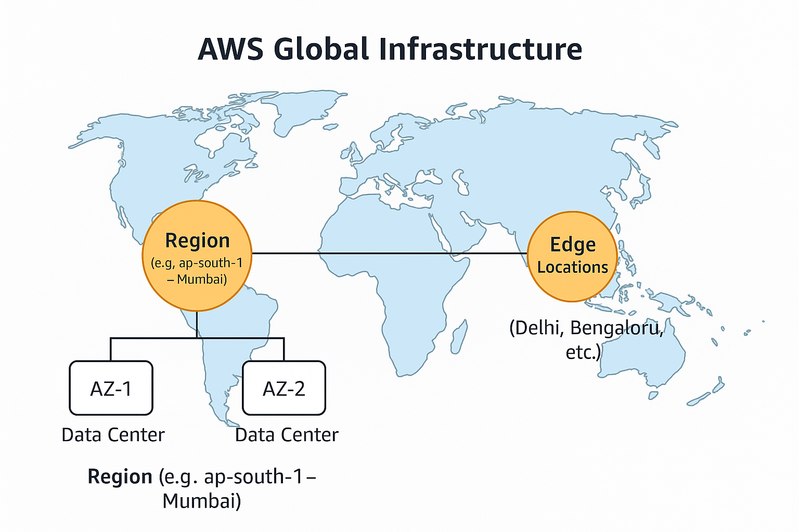

# Day 02 – AWS Global Infrastructure: Regions, Availability Zones, and Edge Locations

In this section, we will explore how AWS is globally structured to deliver services with high availability, low latency, and fault tolerance.

---

## 🌍 What is AWS Global Infrastructure?

AWS has a **global network of data centers** strategically placed around the world. This infrastructure is organized into:

1. **Regions**
2. **Availability Zones (AZs)**
3. **Edge Locations**

---

## 📌 AWS Regions

A **Region** is a geographical area that contains multiple **Availability Zones**.

- Each region is isolated and independent.
- Examples: 
  - `us-east-1` (North Virginia)
  - `ap-south-1` (Mumbai)
  - `eu-west-1` (Ireland)

👉 You choose a region based on:
- Proximity to users
- Regulatory compliance
- Service availability
- Pricing

---

## 🏢 Availability Zones (AZs)

An **Availability Zone** is a physically separate data center (or group of data centers) within a region.

- Each AZ is isolated from failures in other AZs
- Connected with high-speed, low-latency links
- You can design apps for **high availability** by deploying across multiple AZs

✅ Example:
Mumbai region (`ap-south-1`) has 3 AZs:
- `ap-south-1a`
- `ap-south-1b`
- `ap-south-1c`

---

## 📦 Edge Locations (CDN Nodes)

**Edge Locations** are data centers in major cities used by **Amazon CloudFront** to cache and deliver content (like images, videos) to users with low latency.

- Improves performance for static and dynamic content
- Used in services like:
  - CloudFront (CDN)
  - AWS Global Accelerator
  - Route 53 (DNS)

---

## 🧠 Quick Summary:

| Concept           | Description                            | Purpose                         |
|------------------|----------------------------------------|----------------------------------|
| Region           | Group of multiple AZs in a location     | Isolated fault domains          |
| Availability Zone| One or more data centers in a Region    | High availability, fault-tolerant |
| Edge Location    | Cache endpoints close to users          | Fast content delivery (CDN)     |

---

📌 **Next Steps**:  
In Day-03, we will set up **AWS Free tier account**.

---
